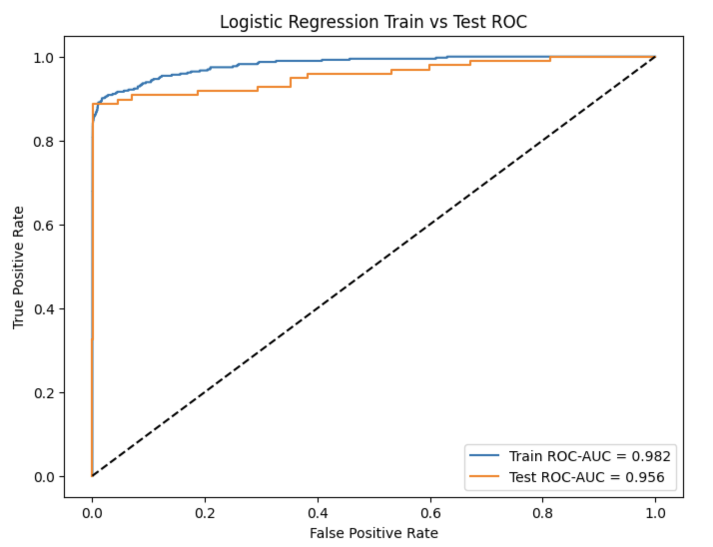
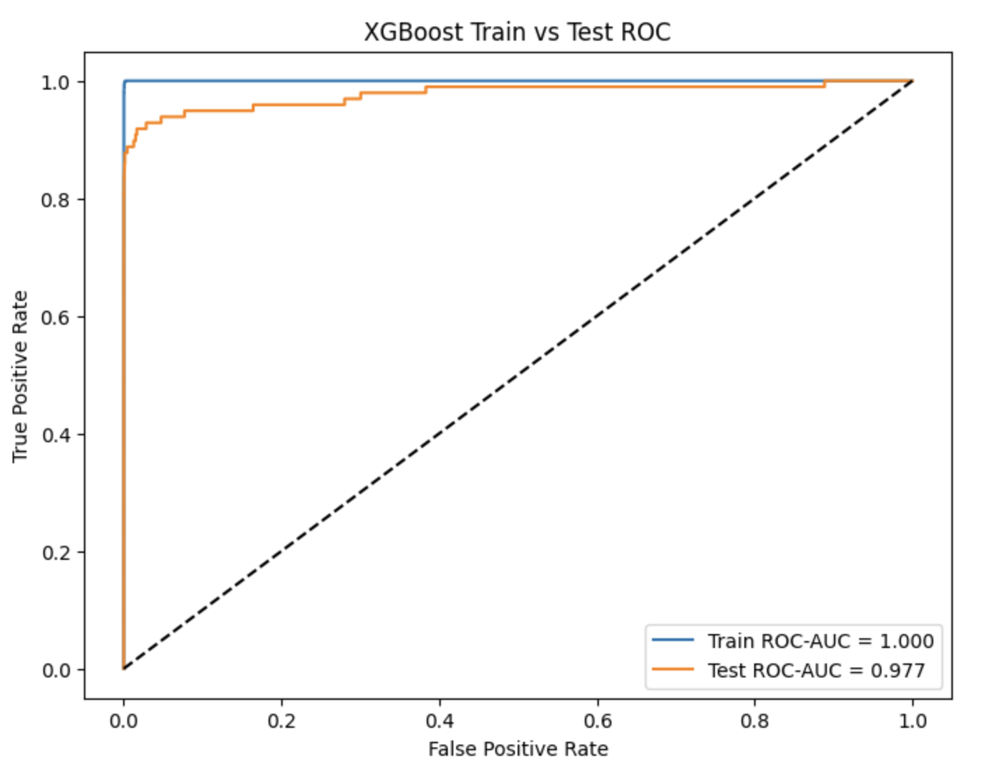
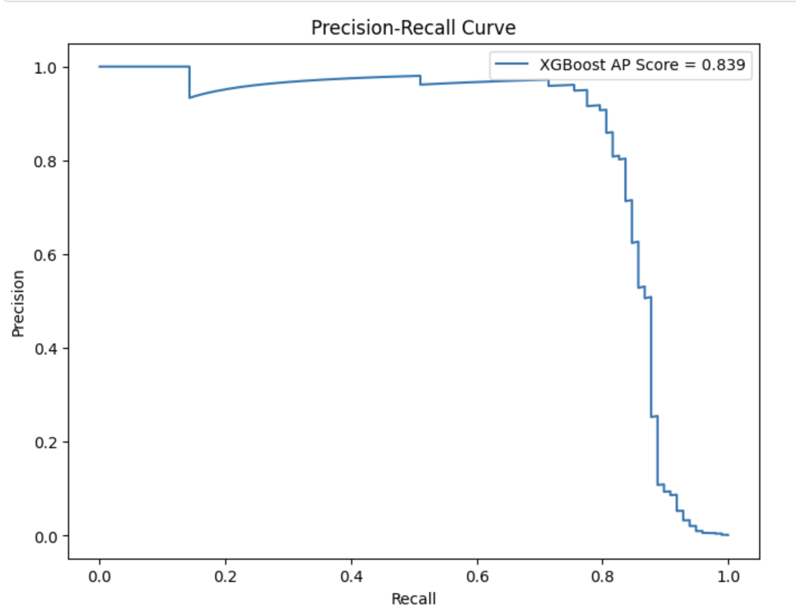
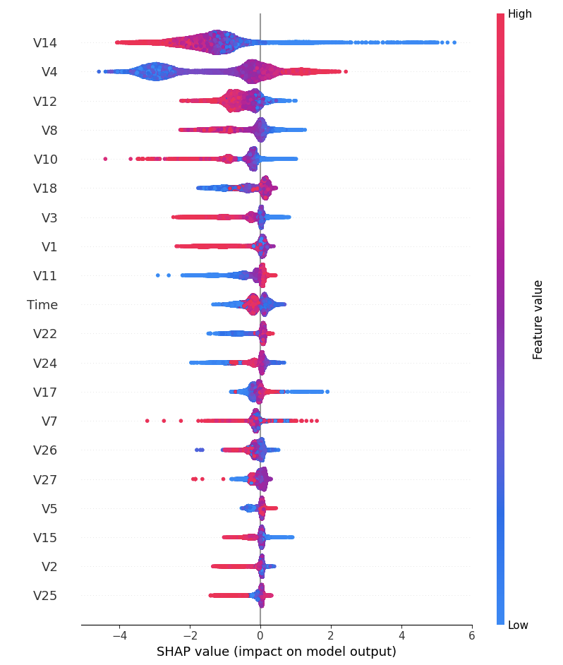
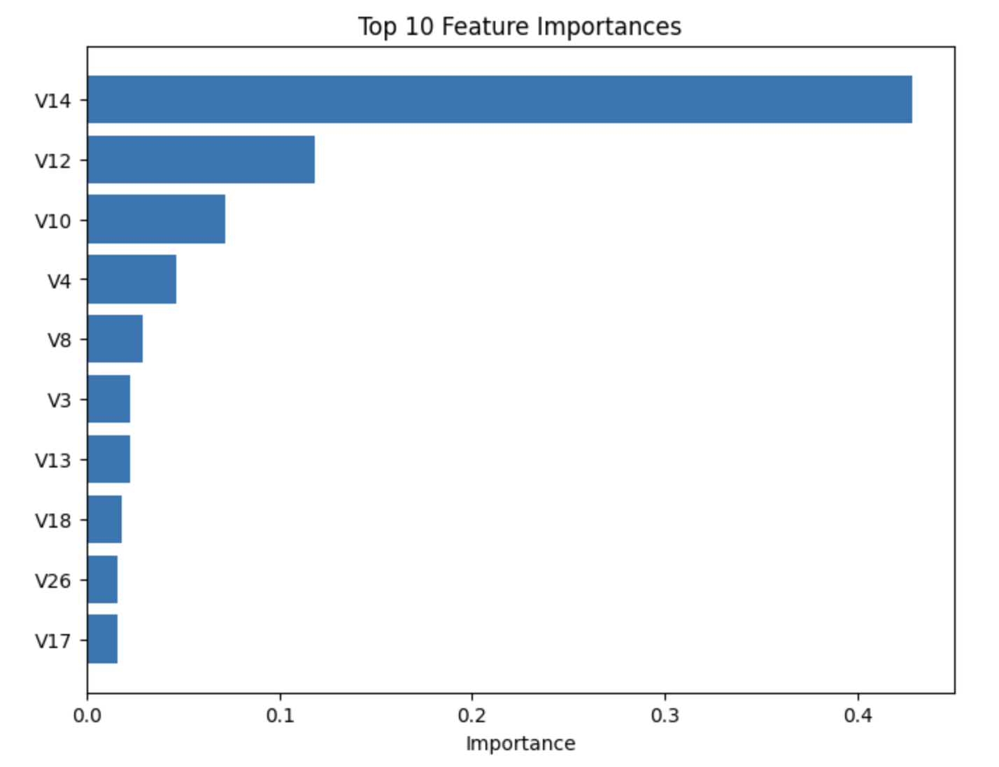

# 💳 Credit Card Fraud Detection using Explainable AI

## Overview
This project focuses on building an industry-grade fraud detection system using machine learning and explainable AI techniques on highly imbalanced credit card transaction data.

**Quick links:** [Business Objective](#business-objective) • [Dataset](#dataset) • [Tech Stack](#tech-stack) • [Results](#key-results) • [Visualizations](#visualizations-included) • [Future Work](#future-improvements)

The workflow includes:
- Logistic Regression baseline model
- XGBoost fraud detection model
- SMOTE-based imbalance handling
- Precision-Recall optimization
- Threshold tuning
- ROC & PR Curve analysis
- SHAP explainability
- Champion–Challenger model comparison

---

## Business Objective
The goal of this project is to identify fraudulent transactions while balancing fraud capture and false-positive rates using business-oriented evaluation metrics.

---

## Dataset
Dataset Used: [Kaggle: mlg-ulb/creditcardfraud](https://www.kaggle.com/datasets/mlg-ulb/creditcardfraud)

### Dataset Characteristics
- 284K+ transactions
- Extreme class imbalance (~0.17% fraud)
- PCA-transformed transaction features

---

## Tech Stack
- Python
- Pandas
- NumPy
- Scikit-learn
- XGBoost
- SHAP
- Matplotlib
- Imbalanced-learn (SMOTE)

---

## ML Workflow
1. Data Understanding & EDA
2. Leakage-safe preprocessing
3. Baseline Logistic Regression
4. SMOTE imbalance handling
5. XGBoost model building
6. Threshold optimization
7. ROC & Precision-Recall evaluation
8. SHAP explainability
9. Champion–Challenger analysis

---

## Key Results
- Achieved ROC-AUC of ~0.98 using XGBoost
- Improved fraud recall to ~88%
- Optimized threshold to improve precision-recall tradeoff
- Used SHAP to identify key fraud-driving features such as V14

---

## Visualizations Included
- ROC Curve Comparison
- Precision-Recall Curve
- SHAP Summary Plot
- Feature Importance Plot
- Train vs Test Stability Analysis
---

### LR ROC Curve

### XGB ROC Curve

### Precision-Recall Curve

### SHAP Summary Plot

### Feature Importance

---

## Future Improvements
- Hyperparameter tuning using Optuna
- Cross-validation pipeline
- Streamlit deployment
- Real-time fraud scoring API
- Ensemble modeling

---

## Author
Shashwat Gupta
